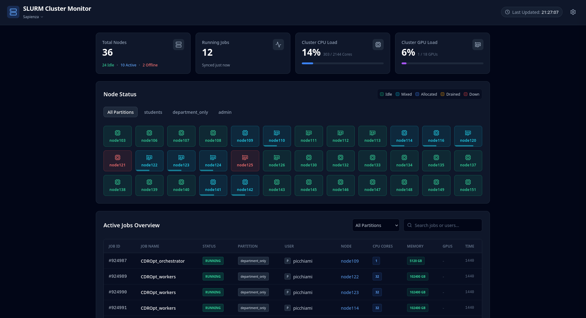

# SLURM Dashboard

A comprehensive tracking and monitoring solution for SLURM backend clusters. This project allows you to seamlessly observe node statuses, active jobs, and overall cluster health.

## Project Architecture

This repository is divided into three main components that work together:

1. **[Data Gatherer](./data-gatherer/)**: A Python-based script designed to be run as a cronjob directly on the SLURM cluster. It extracts the current state of the cluster and sends it securely to the cloud backend.
2. **[Cloudflare Worker](./workers/)**: A serverless edge function that acts as the secure intermediary storage and API backend between the gathering script and the frontend.
3. **[Frontend (Nuxt)](./frontend-nuxt/)**: A modern, responsive web application built with Nuxt 3 and Tailwind CSS that visualizes the cluster data.

Each component has its own documentation detailing setup, configuration, and deployment within its respective directory.

This project was developed for the Cluster of the **Dipartimento di Informatica** of Sapienza University of Rome and for the **[Plumjuice RPi Cluster](https://plum-juice-project.github.io/plum-io/competitive-team)**